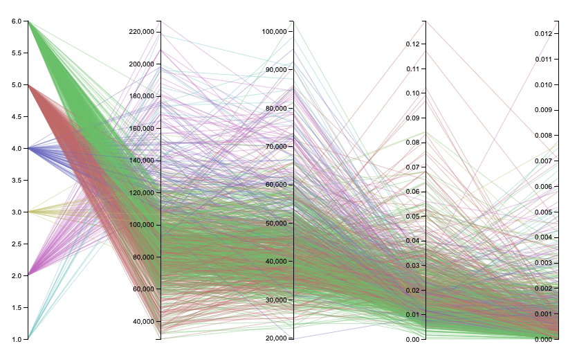

## Dataset

Source: Opportunity Insights 
Publishing Paper: Mobility Report Cards: The Role of Colleges in Intergenerational Mobility 
Data: [opportunityinsights.org/paper/mobilityreportcards](https://opportunityinsights.org/wp-content/uploads/2018/04/mrc_table2.csv) 
Rows: **2198** 
Columns: **40** 
License: Publicly Available Dataset 
Accessed: _February 20, 2020_ 

## Brief Overview
Aiming for the highest grade **(A)** with submission of **_1_** Raw Graphics prototype & **_1_** D3.js (v5) visualization (Parallel Coordinates)

# Intergenerational Mobility Insights

## Parallel Coordinates depicting the role of Colleges in Intergenerational Mobility - Rough Prototype

 

Source: [opportunityinsights.org/paper/mobilityreportcards](https://opportunityinsights.org/wp-content/uploads/2018/04/mrc_table2.csv)

## Intepretation

The intention was to visualize and compare the several individual observations in regards to each college. Each line represents a college. Each vertical bar represents a variable pertaining to the college and it has it's own scale (linear scale with min-max value bounds). The observations chosen are following (left-to-right):

`Tier` : Representing selectivity and type combination (e.g. Selective Private) 
`Mean Parental Income` 
`Mean Kid Earnings` 
`Mobility Rate` : Probability of parents in the bottom quantile and child (student) in the top quantile of income distribution 
`Upper-Tail Mobility Rate` : Probability of parents in the bottom quantile and child (student) in the top 1% of income distribution

It is worthwhile noting the tier number encodings:

1. Ivy Plus, 
2. Other elite schools (public and private),
3. Highly selective public, 
4. Highly selective private, 
5. Selective public, 
6. Selective private

The prototype is a bit messy. Parallel coordinates are difficult to interpret without brushing simply because of the data density. This, alongside with legend for color encoding, has been adjusted in the D3 implementation. The big challenge was a decision where to place the legend because this type of visualizations takes up a lot of space, especially in width. Still, it made most visual sense to place it on the right hand side, despite it being a tight fit.

## Data Wrangling

A row represents a college with all the respective observations. There was no specific data wrangling or any other kind of transformation. One thing perfomed on the data was filtering based on the above mentioned tier. The following tiers have been filtered out from the data:

* Nonselective 4-year public, 
* Nonselective 4-year private not-for-profit,
* Two-year (public and private not-for-profit), 
* Four-year for-profit, 
* Two-year for-profit, 
* Less than two year schools of any type,
* Attending college with insufficient data
* Not in college between the ages of 19-22

You can find the filtered data [here](../d3-vis/h2-parallel/mrc_table2.csv).

## Conclusions

We can make the following conclusion that the authors state in the paper: 

> ...Rates of upward mobility – the fraction of students who come from families in the bottom income quintile and reach the top quintile – differ substantially across colleges because low-income access varies significantly  across  colleges  with  
similar  earnings  outcomes.

We can also conclude that the rates of bottom-to-top quantile mobility are really high for highly selective public colleges.

Another thing that sticks out is that, the higher selectivity of the college, the bigger the odds that the student is coming from a family with higher income.

Upper-tail mobility varies, although on average it seems that it fancies Ivy Plus tier and Other elite schools (public and private).

### Parallel Coordinates depicting the role of Colleges in Intergenerational Mobility

<svg id="parallel"></svg>

_Author: Dejan Djokic_  
_Original Data Source: [opportunityinsights.org/paper/mobilityreportcards](https://opportunityinsights.org/wp-content/uploads/2018/04/mrc_table2.csv)_ 

Resources/Inspirations: 

_[Data-To-Viz](https://www.data-to-viz.com/graph/parallel.html)_ 
_[D3-Graph-Gallery Ex 1](https://www.d3-graph-gallery.com/graph/parallel_basic.html)_ 
_[D3-Graph-Gallery Ex 2](https://www.d3-graph-gallery.com/graph/parallel_custom.html)_ 
_[Homework 1]()_ 

<link href="https://fonts.googleapis.com/css?family=Roboto" rel="stylesheet">
<link href="../stylesheets/style-h2.css" rel="stylesheet">
